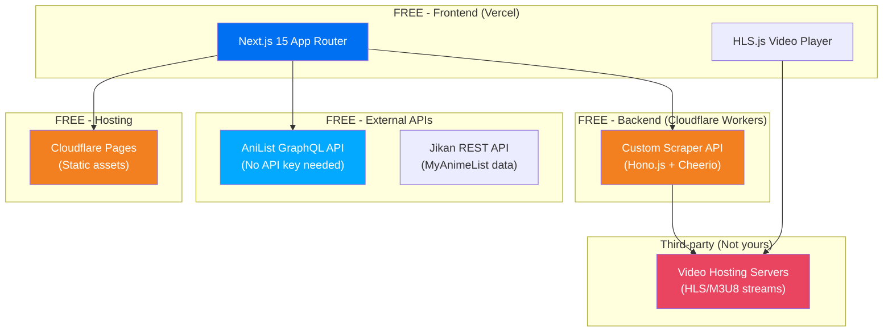

# 🛠️ Building an Anime Streaming Aggregator Like Animelok — ₹0 Budget

> [!CAUTION]
> **Legal Disclaimer**: Scraping and redistributing copyrighted anime content is illegal in most jurisdictions. This guide is for **educational purposes only** to understand how such systems work technically. If you build a real product, use **licensed content** or partner with distributors.

---

## Total Cost: ₹0 (Completely Free)

Every single tool in this stack has a free tier that's sufficient for a working project:

| Component | Free Tool | Free Tier Limit |
|---|---|---|
| **Frontend Framework** | Next.js | Open source, unlimited |
| **Hosting (Frontend)** | Vercel | 100GB bandwidth/month |
| **Metadata API** | AniList GraphQL | 90 requests/min, no key needed |
| **Scraper Backend** | Self-hosted (Consumet fork / custom) | Open source, unlimited |
| **Scraper Hosting** | Cloudflare Workers / Vercel Serverless | 100K requests/day (CF) |
| **Static Assets / CDN** | Cloudflare Pages | Unlimited bandwidth |
| **Video Player** | HLS.js | Open source, unlimited |
| **Database (optional)** | Supabase / Turso | Free tier |
| **Analytics** | Google Analytics / Umami | Free |
| **Domain (optional)** | Freenom (.tk) / buy cheap .online | ₹0 or ~₹100/year |

---

## Architecture Overview



---

## Layer-by-Layer Breakdown

### Layer 1: Anime Metadata — AniList GraphQL API (FREE)

This is 100% free, no API key required, and completely legal. AniList is a public anime database.

**Endpoint:** `https://graphql.anilist.co`  
**Rate Limit:** 90 requests/minute  
**Auth:** None needed  

#### Example: Search for anime
```javascript
// lib/anilist.js
const ANILIST_URL = "https://graphql.anilist.co";

const SEARCH_QUERY = `
query ($search: String, $page: Int, $perPage: Int) {
  Page(page: $page, perPage: $perPage) {
    pageInfo {
      total
      currentPage
      hasNextPage
    }
    media(search: $search, type: ANIME, sort: POPULARITY_DESC) {
      id
      title {
        romaji
        english
        native
      }
      coverImage {
        large
        extraLarge
      }
      bannerImage
      description
      genres
      episodes
      status
      averageScore
      season
      seasonYear
      format
    }
  }
}
`;

export async function searchAnime(query, page = 1) {
  const res = await fetch(ANILIST_URL, {
    method: "POST",
    headers: { "Content-Type": "application/json" },
    body: JSON.stringify({
      query: SEARCH_QUERY,
      variables: { search: query, page, perPage: 20 },
    }),
  });
  const data = await res.json();
  return data.data.Page;
}
```

#### Example: Get trending anime
```javascript
const TRENDING_QUERY = `
query ($page: Int, $perPage: Int) {
  Page(page: $page, perPage: $perPage) {
    media(type: ANIME, sort: TRENDING_DESC) {
      id
      title { romaji english }
      coverImage { large extraLarge }
      bannerImage
      description
      genres
      episodes
      averageScore
      status
    }
  }
}
`;

export async function getTrending() {
  const res = await fetch(ANILIST_URL, {
    method: "POST",
    headers: { "Content-Type": "application/json" },
    body: JSON.stringify({
      query: TRENDING_QUERY,
      variables: { page: 1, perPage: 10 },
    }),
  });
  const data = await res.json();
  return data.data.Page.media;
}
```

**What AniList gives you for FREE:**
- ✅ Anime titles (in all languages)
- ✅ Cover art & banner images (hosted on their CDN)
- ✅ Descriptions, genres, tags
- ✅ Episode counts & airing schedules
- ✅ Ratings, popularity, trending
- ✅ Character & staff info
- ✅ Relations (sequels, prequels)
- ✅ Studio information

---

### Layer 2: Streaming Sources — Self-Hosted Scraper (FREE)

> [!WARNING]
> This is the legally questionable part. The scraper extracts video URLs from third-party sites. Use this knowledge responsibly.

#### Option A: Fork Consumet (Easiest)

Consumet is open-source on GitHub. You can fork it and host your own instance:

```bash
# Clone the Consumet API
git clone https://github.com/consumet/api.consumet.org.git
cd api.consumet.org
npm install

# Run locally
npm start
# → Runs at http://localhost:3000
```

**Then deploy for free to:**
- **Vercel** → `vercel deploy` (free serverless)
- **Railway** → Free tier (500 hours/month)
- **Render** → Free tier

**Usage after deploying:**
```javascript
// Your own private scraper API
const SCRAPER_URL = "https://your-consumet-instance.vercel.app";

// Search for anime on a provider
const results = await fetch(`${SCRAPER_URL}/anime/gogoanime/search?q=naruto`);

// Get episode streaming sources
const sources = await fetch(`${SCRAPER_URL}/anime/gogoanime/watch/episode-1`);
// Returns: { sources: [{ url: "https://...m3u8", quality: "1080p" }] }
```

#### Option B: Build Custom Scraper with Cheerio (More Control)

```javascript
// scraper/index.js — Using Hono.js (deploys to Cloudflare Workers FREE)
import { Hono } from "hono";
import * as cheerio from "cheerio";

const app = new Hono();

app.get("/api/search/:query", async (c) => {
  const query = c.req.param("query");
  
  // Scrape a source site
  const html = await fetch(`https://example-anime-site.com/search?q=${query}`)
    .then(r => r.text());
  
  const $ = cheerio.load(html);
  const results = [];
  
  $(".anime-card").each((i, el) => {
    results.push({
      title: $(el).find(".title").text(),
      slug: $(el).find("a").attr("href"),
      image: $(el).find("img").attr("src"),
    });
  });
  
  return c.json({ results });
});

app.get("/api/watch/:episodeId", async (c) => {
  const id = c.req.param("episodeId");
  
  // Scrape the episode page for the video embed
  const html = await fetch(`https://example-anime-site.com/watch/${id}`)
    .then(r => r.text());
  
  const $ = cheerio.load(html);
  
  // Extract the iframe embed or direct M3U8 URL
  const embedUrl = $("iframe#video-player").attr("src");
  
  // Some sites need a second fetch to get the actual M3U8
  const embedHtml = await fetch(embedUrl).then(r => r.text());
  const m3u8Match = embedHtml.match(/file:\s*"(https?:\/\/[^"]+\.m3u8[^"]*)"/);
  
  return c.json({
    sources: [{
      url: m3u8Match?.[1] || null,
      type: "hls",
    }]
  });
});

export default app;
```

**Deploy to Cloudflare Workers (FREE):**
```bash
npm create cloudflare@latest my-scraper
# Select "Hono" template
# Copy your scraper code
npx wrangler deploy
# → Free: 100,000 requests/day
```

---

### Layer 3: Video Player — HLS.js (FREE)

```javascript
// components/VideoPlayer.jsx
"use client";
import { useEffect, useRef } from "react";
import Hls from "hls.js";

export default function VideoPlayer({ src }) {
  const videoRef = useRef(null);

  useEffect(() => {
    const video = videoRef.current;
    if (!video || !src) return;

    if (Hls.isSupported()) {
      const hls = new Hls({
        maxBufferLength: 30,
        maxMaxBufferLength: 60,
      });
      hls.loadSource(src); // The .m3u8 URL
      hls.attachMedia(video);
      hls.on(Hls.Events.MANIFEST_PARSED, () => {
        video.play().catch(() => {});
      });

      return () => hls.destroy();
    } else if (video.canPlayType("application/vnd.apple.mpegurl")) {
      // Safari native HLS support
      video.src = src;
    }
  }, [src]);

  return (
    <video
      ref={videoRef}
      controls
      className="w-full aspect-video rounded-xl bg-black"
      playsInline
    />
  );
}
```

---

### Layer 4: Frontend — Next.js on Vercel (FREE)

```bash
npx create-next-app@latest my-anime-site
cd my-anime-site
npm install hls.js
npm run dev
```

**Free Vercel deployment:**
```bash
npm i -g vercel
vercel deploy
# → https://my-anime-site.vercel.app (FREE)
```

---

### Layer 5: Static Assets — Cloudflare Pages (FREE)

```bash
# Upload your images/banners to Cloudflare Pages
npx wrangler pages project create anime-assets
npx wrangler pages deploy ./public/assets
# → https://anime-assets.pages.dev (FREE, unlimited bandwidth)
```

---

## Complete Project Structure

```
my-anime-site/
├── app/
│   ├── layout.js              # Root layout (fonts, theme)
│   ├── page.js                # Landing page
│   ├── home/
│   │   └── page.js            # Browse page (trending, latest)
│   ├── anime/
│   │   └── [slug]/
│   │       └── page.js        # Anime detail + episodes
│   ├── watch/
│   │   └── [episodeId]/
│   │       └── page.js        # Video player page
│   └── search/
│       └── page.js            # Search results
├── components/
│   ├── VideoPlayer.jsx        # HLS.js player
│   ├── AnimeCard.jsx          # Anime thumbnail card
│   ├── Carousel.jsx           # Hero spotlight
│   └── Navbar.jsx             # Navigation
├── lib/
│   ├── anilist.js             # AniList GraphQL client
│   └── scraper.js             # Your scraper API client
├── public/
│   └── assets/                # Static images
└── package.json
```

---

## Free Hosting Comparison

| Service | Free Tier | Best For |
|---|---|---|
| **Vercel** | 100GB BW, serverless functions | Next.js frontend |
| **Cloudflare Workers** | 100K req/day, 10ms CPU | Scraper API backend |
| **Cloudflare Pages** | Unlimited BW, 500 builds/month | Static assets / CDN |
| **Railway** | $5 free credit/month | Backend API |
| **Render** | 750 hours/month | Backend API |
| **Supabase** | 500MB DB, 1GB storage | User data (watchlists) |
| **GitHub Pages** | Unlimited (static only) | Documentation |

---

## ⚠️ Key Challenges You'll Face

| Challenge | Solution |
|---|---|
| **Source sites change HTML structure** | Your scraper will break → need frequent updates |
| **Cloudflare protection on source sites** | Use `puppeteer` / `playwright` for JS-rendered pages |
| **Rate limiting on free tiers** | Add Redis caching (Upstash has free tier) |
| **CORS issues with M3U8 streams** | Proxy the stream through your backend |
| **Source sites go down** | Support multiple providers with fallback |
| **ISP blocks your domain** | Use Cloudflare CDN proxy to hide server IP |
| **Legal takedowns** | The biggest risk — no technical solution for this |

---

## Summary: What Costs ₹0

```
✅ Next.js               → FREE (open source)
✅ AniList API            → FREE (no key, 90 req/min)
✅ Consumet/Custom Scraper → FREE (open source, self-hosted)
✅ HLS.js Player          → FREE (open source)
✅ Vercel Hosting          → FREE (100GB/month)
✅ Cloudflare Workers      → FREE (100K req/day)
✅ Cloudflare Pages CDN    → FREE (unlimited bandwidth)
✅ Google Analytics        → FREE
✅ Tailwind CSS            → FREE (open source)
───────────────────────────
💰 TOTAL                  = ₹0
```

> [!NOTE]
> The **only thing you might pay for** is a custom domain name (~₹100-800/year for `.online`, `.in`, `.xyz`). But even that's optional — Vercel gives you a free `.vercel.app` subdomain.
